# Design documents
**Name:** Nguyen Bao Han (s4125775)

**Project title:** Drop by drop
### Group name: Quán ốc cây mè

**Group members’ names:**

Nguyen Le Quynh Anh - s4015149

Ha Minh Hoang - s4129129

Nguyen Thai Phuong Nam - s4106115

Nguyen Quoc Cao Tri - s3971172

---
## Quote & Call to action
---

>Quote: “The greatest threat to our planet is the belief that someone else will save it.” (Sustainability and Acciona n.d.)

**Call to Action:** “Buy secondhand.”

---

---
## Abstract
---
#### A1:
This project is an interactive, web-based generative artwork that advocates for SDG 13: Climate Action.

The project aims to highlight the importance of water and demonstrate how small, everyday actions can contribute to the fight against climate change. Through interactive visuals and generative elements, the webpage encourages users to reflect on their relationship with water and the environment.

The message behind the project is simple: individual actions matter. Every small effort contributes to a larger collective impact. Each individuals have the power to change the world, as long as we all join in “ Drop by drop”, we will make a big difference.

By engaging users in an immersive and interactive experience, the project hopes to inspire awareness, responsibility, and action toward protecting our planet.

#### A2:

This project is an interactive, web-based generative artwork that advocates for SDG 13: Climate Action. It focuses on exposing the often-overlooked environmental impact of fast fashion—particularly the emissions generated through global transportation and shipping.

Through dynamic visuals and interactive generative elements, the webpage invites users to reflect on their consumption habits and consider the consequences behind each purchase. Rather than presenting information passively, the experience actively engages users, making the issue more immediate and personal.

At its core, the project aims to convey that individual actions matter. Small, conscious choices—when multiplied across millions—can create meaningful change. Each person holds the ability to influence the larger system, and collective effort is key to addressing the climate crisis.

---

## Background research

#### A1:

### Related works

The rapid growth in global water demand highlights the urgent need for stronger water conservation efforts. As shown in the chart, domestic water withdrawals have increased by more than 600% since the 1960s, reflecting population growth, urbanization, and rising consumption.

##### *Figure 1: Domestic water use growth from 1960–2014. Source: World Resources Institute (2020).*

The water that we use in our daily-lives went through a lengthy process of being pumped from rivers, bays, and estuaries to being treated, heated and transported. All of which requires a lot of energy and creates a lot of emissions, not to mention the direct impact of detracting water from the environment.

##### *Figure 2: Centers for Disease Control and Prevention (CDC), Drinking Water (2024).*

#### A2:

### Target audience

**Demographics:** People from 15-25 years old (GenZ); all genders; ongoing education

**Geographics:** Urban areas, cities that heavily polluted

**Psychographics:** People who are interested in thrifting culture and buying secondhand stuff, have sustainable lifestyle and care about environment health, artists who are interested in artistic websites

**Behaviorals:** People who purchase a lot of thrifting clothes, who have a habit of reusing and recycling products

**Why We Focus on Gen Z:** As the primary drivers of the thrift economy, Gen Z represents a unique intersection of consumption and conscience. Despite stereotypes of individualism, this generation consistently leads global climate advocacy and environmental action. Their open-minded nature and willingness to evolve make them the ideal audience for our project; they don't just view art, they seek to understand the deeper, abstract meanings behind visuals to help shift their perspectives on the world.

### Related works

From raw material sourcing to manufacturing to final delivery, the constant movement of fast fashion garments majorly increases emission, especially if companies favour air transport for speed.  

Global fashion is responsible for around 10% of total carbon emissions, with transportation playing a major role in that footprint (United Nations Environment Programme, 2023).

Some studies show that production and transport can account for up to 91% of a garment’s total emissions, depending on the product lifecycle (MDPI, 2024).

Transportation is often invisible to consumers—yet it remains one of the largest hidden contributors to fast fashion’s environmental impact.

The faster clothes move, the higher the environmental cost.

---
## Moodboard

#### A1:

##### *Figure 3: Dancing In The Rain, s4ns4n2 (2021).*

##### *Figure 4: Round 3, VIVINOS (2023).*

##### *Figure 5: Bee and Puppycat, Allegri (2022).*

#### A2:

##### *Figure 6: LIGHTNERS LIVE, Spec (2025).*

After extensive experimentation and iteration across different visual directions, our group ultimately adopts a Modern Punk aesthetic. This style resonates strongly with Gen Z, reflecting their emphasis on individuality and self-expression.

Modern Punk challenges mainstream trends and consumer culture, making it a fitting visual language for critiquing fast fashion. It's centered around thrifting, repurposing, and customizing clothing—aligns naturally with more sustainable practices, reinforcing the project’s message through both form and content.

---
---
## Project question
**How might we effectively make an impactful call to action webpage?**

---
## Creative practice
---

#### A1:

### Ideation

After considerable discussion and refinement, our group decided to focus on Sustainable Development Goal 13: Climate Action. Our chosen approach is to highlight Earth Day activities as a way to encourage environmental awareness and action.

Earth Day features many activities that are both visually engaging and meaningful, making them well suited for representation through generative art. These activities—such as planting trees, conserving water, cleaning local environments, and reducing waste—can be easily visualized through interactive elements while also conveying powerful environmental messages.

Most importantly, these actions are simple and accessible, allowing people from all backgrounds to participate.

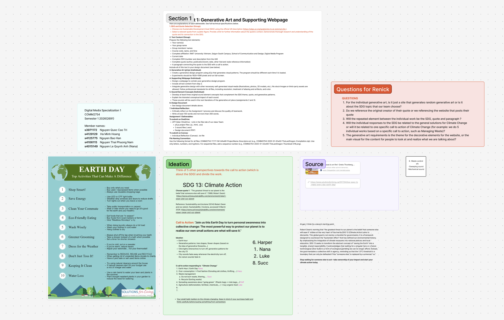

For my section of the project, I chose to focus on Action 10, as the theme of saving water offers strong potential for visual representation. Its fluid and dynamic nature makes it particularly suitable for generative and interactive visuals. This allows the page to effectively communicate the importance of water conservation while creating an engaging and immersive experience for users.

##### *Figure 6: Solutions for Living (2017).*

I have always seen rain as something ethereal. It plays a crucial role in creating and sustaining life, yet it also has the power to bring destruction through storms and floods. This dual nature inspired me to connect rain with the imagery of stars and meteorites. Much like rain, they are beautiful and mesmerizing to watch in the night sky, yet they also hold the potential for destruction.

This contrast between beauty and power became the foundation of the artwork. In the piece, raindrops fall like stars or meteorites from the sky. However, instead of causing harm, each drop that touches the ground gives rise to new life. Plants, creatures, or other forms of life begin to emerge, symbolizing how water is essential for life on Earth.

Through this visual metaphor, the artwork emphasizes the importance of water and reminds viewers that something as small as a single drop can contribute to the growth and sustainability of life.

### Iteration

Early versions. Testing more star and light related concepts.

This iteration is when I finally settle into the meteorites/ shootingstars concept.

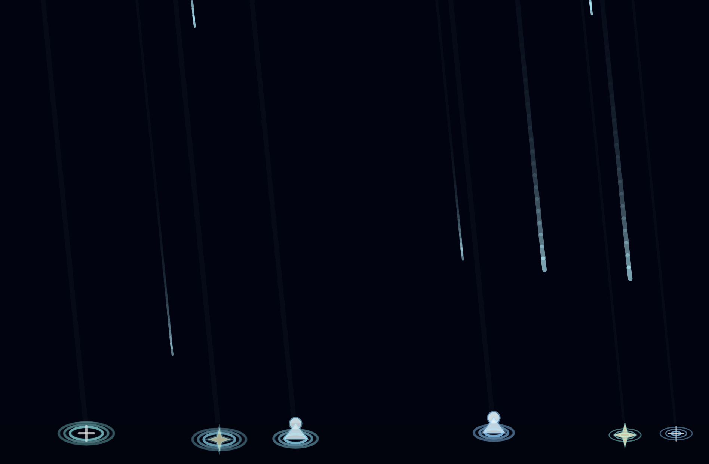

### Sounds

**1.Heartbeat**

The ambient sound of the webpage will be “Heartbeat.” The rhythm is created using the sound of falling raindrops, arranged to resemble the steady pulse of a heartbeat. This sound design reinforces the central theme of the artwork: water as the source of life.

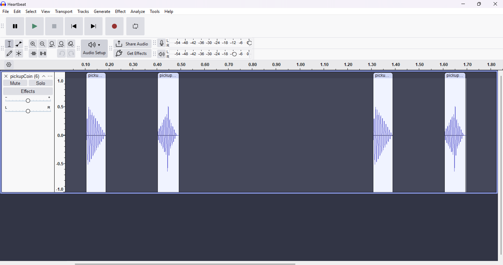

The “Heartbeat” sound was originally intended to be a recorded audio sample created by dropping water into a bowl filled with water. But I never quite got the result that I'm satisfied with so I turned to jsfxr instead. 

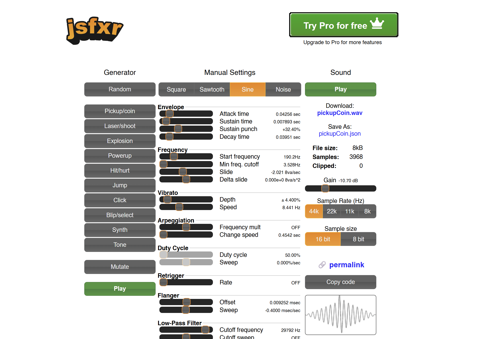

**2.Gather**

The “Gather” sound plays each time the user successfully catches a raindrop. The sound was created by recording the noise of a metal spoon lightly hitting a mug filled with water. This produces a soft, resonant tone that resembles the delicate ringing of a drop being collected.

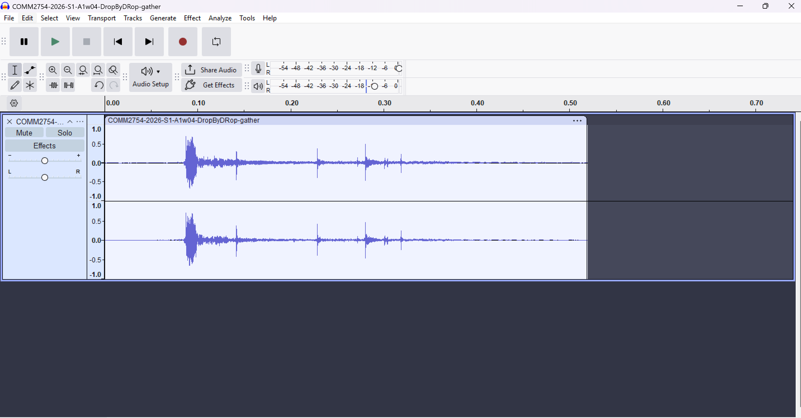

**3.Bloom**
The “Bloom” sound plays when the user successfully collects enough raindrops. At this moment, the circle bursts open and new life emerges within the scene, marking a rewarding milestone in the interaction. The sound was created by dropping water into another body of water, producing a soft splash.

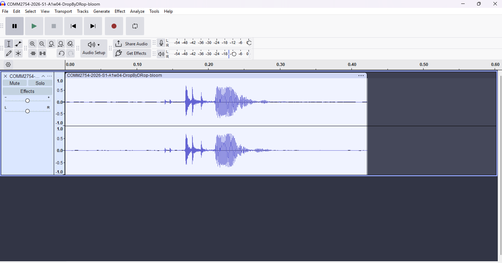

#### A2:

### Ideation

Our group chose to focus on the issue of fast fashion, an industry that generates significant environmental waste at every stage—from production and transportation to retail and disposal.

As a response, we propose thrifting as a practical and accessible solution. It is affordable for young people, easy to adopt, and extends the lifecycle of clothing by keeping garments in use longer. In addition to reducing waste, thrifting also supports local businesses and communities, making it a sustainable choice with both environmental and social benefits.

This constant movement of garments — from raw materials to finished products — creates a substantial carbon footprint. The industry’s reliance on planes for shipping to meet rapid turnaround times further intensifies emissions, making transportation a major contributor to fast fashion’s environmental impact.

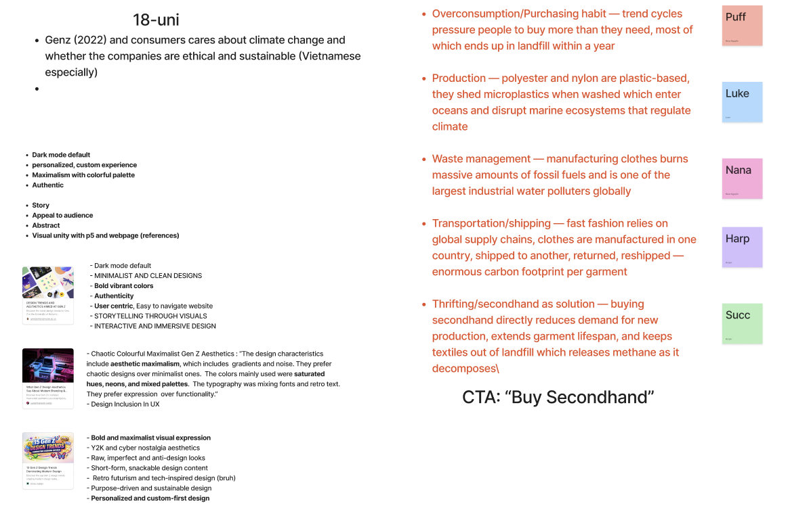

### Iteration

For our initial unified visual direction, we chose pixel art for its simplicity and its ability to evoke a sense of nostalgia. This style helps create an immediate emotional connection with users while keeping the visuals clear and accessible.

This was our original call-to-action, where my focus centered on water conservation, I used pixel art to try to convey the flow of water.

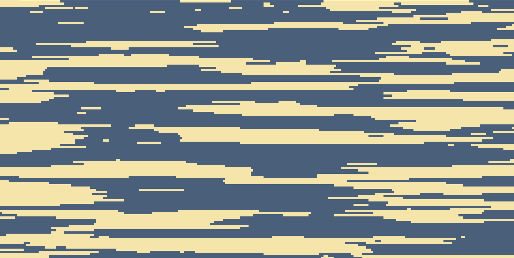

Following feedback, we reworked the project from the ground up—revisiting both the call-to-action and the overall visual direction. My focus shifted to the environmental impact of transportation and shipping, while the visual style evolved into maximalism.

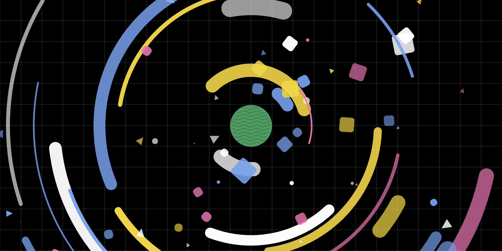

After some more feedbacks, we set a stricter rule for unification by using primary shapes, grain texture, specific color palette.

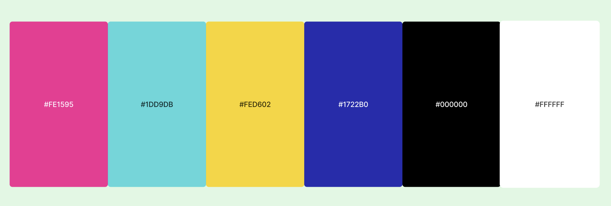

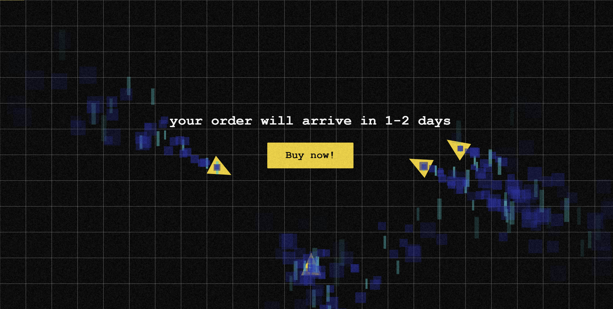

### Sounds

**Ring 1, 2 & 3**

The 2 “ring” sounds are triggered whenever users interact with the pop-ups. They are bright and playful—designed to mimic the satisfying feedback often used to entice users into making a purchase. The sound was created using jsfxr.

**Humming and humming2**

A low “humming” sound plays as ambient audio during the final stage. Designed to mimic the steady drone of engines, this layer of white noise reinforces the smoke-filled visuals and intensifies the atmosphere. The sound was also created using jsfxr.

“Humming 2” is noticeably harsher than “Humming 1,” heightening the sense of discomfort as the smog grows denser.

### Codes

**Smoke**

Smoke is triggered in the draw() loop based on two conditions:

Enemy Planes: If an enemy plane is on screen, it spawns smoke every 10–14 frames.
Main Plane: If the player is scrolling (moving), the main plane spawns smoke.

function spawnSmoke(x, y, lifespanMultiplier) {

  let life = SMOKE_BASE_LIFESPAN * lifespanMultiplier;

  // Spawns three distinct particles per "puff"

  particles.push(new SmokeParticle(x, y, 'square', life, int(random(1, 4))));

  particles.push(new SmokeParticle(x, y, 'square', life, int(random(1, 4))));

  particles.push(new SmokeParticle(x, y, 'rect', life, int(random(1, 4))));

}

Lifespan Multiplier: As you scroll deeper into the "Stages," the smoke lasts longer, creating denser trails.
Diversity: Every "puff" is actually a mix of squares and thin rectangles to create visual complexity.
Growth: this.size += 0.2; – The particles get slightly larger as they age, mimicking expansion.
Fade: The alphaPhase (transparency) is calculated based on remaining life: map(this.life, 0, this.maxLife, 0, 1).

**Vector Cut**

When a particle is born, createSmokeCuts decides which edges will be "damaged."
It chooses a random edge (top, bottom, left, or right).
It picks a position (t) away from the center to keep the shape recognizable.
It stores these instructions in the this.cuts array.

In the display() method, the code uses a Canvas trick:

drawingContext.globalCompositeOperation = 'destination-out';

The code first draws the solid blue or cyan shape.
It switches the "Composite Operation" to destination-out. In this mode, anything drawn next acts like an eraser rather than a paintbrush.
It draws the triangles defined in this.cuts. Because of the mode above, these triangles "bite" holes into the smoke particle.
It resets the mode back to default so other things can be drawn normally.

**The progression of cuts on the main triangle**

The number of cuts is tied to your "Stage" (how far you have scrolled). This is determined by getStageVCutCount():

Stage 0 (Start): 0 cuts (A smooth, perfect triangle).
Stage 1 (1000+ scroll): 1 cut on the Right Wing.
Stage 2 (3000+ scroll): 2 cuts (Right and Left Wings).
Stage 3 (5000+ scroll): 3 cuts (Right, Left, and Back Edge).

---
## Dicussion
---

#### A1:
Assignment 1 gave me the opportunity to explore generative art in greater depth. One of the biggest challenges I faced was figuring out how to execute my concept in a way that felt both interesting and visually balanced. I wanted the generative artwork to support the message of the webpage while also being strong enough to stand on its own as an independent piece.

Another challenge was recording the sounds for the project. I experimented with creating my own recordings, but I struggled to achieve the exact sound performance and quality that I had envisioned. As a result, I had to explore alternative approaches to produce the audio elements.

Although the final result has not fully met my expectations, Assignment 1 served as an important learning experience. It allowed me to experiment with new ideas and techniques, and I hope to further refine and improve the project in the next assignment.

Our group worked well together during the ideation stage, particularly when selecting the quote, Sustainable Development Goal (SDG), and the call to action. The discussions allowed us to share ideas and refine the overall concept collaboratively.

However, the visual styles we each chose for our individual works seem to differ quite a bit. While this allowed everyone to express their own creative direction, I am slightly concerned that the differences may clash when everything is combined in Assignment 3. I hope that when the final project is assembled, the various styles can still come together in a cohesive way.

#### A2:

Assignment 2 involved a significant overhaul of our initial ideas and call-to-action, as we explored new visual directions and established a clear set of rules and constraints to maintain consistency across the project.

The unification process proved to be the most challenging aspect. We had to strike a balance between individual creativity and a cohesive visual identity, ensuring that each contribution remained unique without straying too far from the established style guide. Another key challenge was developing generative visuals that were abstract yet still legible and meaningful to users.

Despite these difficulties, our group made strong progress in aligning both our visual language and our workflow. We improved communication by consistently sharing work-in-progress updates and actively consulting one another—as well as our lecturer—to clarify ideas and resolve misunderstandings early on.

---
## References
---

Sustainability and Acciona (2014) Robert Swan and our planet, Sustainability | Acciona, accessed 5 March 2026. <https://www.activesustainability.com/environment/robert-swan-and-our-planet>

Otto, B & Schleifer, L 2020, Domestic water use grew 600% over the past 50 years, World Resources Institute, 10 February, viewed 15 March 2026. <https://www.wri.org/insights/domestic-water-use-grew-600-over-past-50-years>

Centers for Disease Control and Prevention 2024, How water treatment works, 6 February, viewed 17 March 2026. <https://www.cdc.gov/drinking-water/about/how-water-treatment-works.html>

s4ns4n2 2021, Dancing In The Rain, Instagram post, 23 July, viewed 20 March 2026. <https://www.instagram.com/p/CRrAj1mHvxc/>

VIVINOS 2023, ROUND3 | Alien Stage, YouTube video, 5 January, viewed 20 March 2026. <https://www.youtube.com/watch?v=2cFnfD4iZzM>

Allegri, N. 2022, Bee and PuppyCat: Lazy in Space, animated television series, Netflix, USA.

Solutions for Living 2017, Top ways to make every day Earth Day, Solutions for Living, viewed 11 March 2026. <https://www.solutionsforliving.ca/2017/04/top-ways-to-make-every-day-earth-day/>

United Nations Environment Programme 2023, Sustainability and Circularity in the Textile Value Chain, UNEP, viewed 18 April 2026. <https://www.unep.org/annualreport/2025/stories/minimizing-fashions-environmental-footprint>

MDPI 2024, Environmental impacts of fast fashion supply chains, Sustainability Journal, viewed 20 April 2026. <https://www.unep.org/events/unep-event/pollution-free-nature-positive-net-zero-fashion>

spec 2025, LIGHTNERS LIVE, post on X, 8 October, viewed 24 April 2026. <https://x.com/_officialspec/status/1975659926551994457>